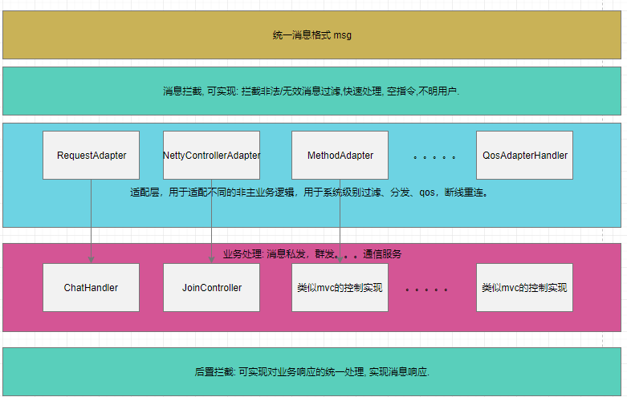
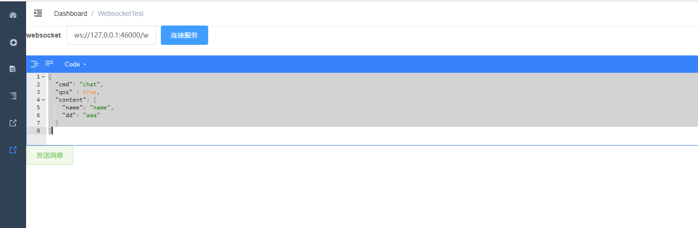

# GIM

#### 介绍
目标: 只需完成自己的业务逻辑, 就能实现即时通信, 整合spring开发可以让你写web开发一样方便, 让项目简单方便接入通信推送聊天服务。


#### 目录结构

> demo (使用demo)
>
> > test-noframework-im-server (非框架整合)
> > test-spring-im-server (spring boot 框架整合)
> > websocket-js (前端js使用)
>
> develop (待开发)
>
> > web-rtc (音视频)
>
> extends (扩展功能)
>
> > gylang-cache-manager (缓存使用)
> > gylang-cross-server-im-starter (集群扩展)
>
> gim (聊天项目使用)
>
> > gim-api-server (api/web服务)
> > gim-chat-server (通信服务)
> > gim-client-java (java客户端)
> > gim-data-center (im 数据中心)
>
> sdk (im sdk)
>
> > gim-admin-remote-sdk (服务管理端接入)
> > gim-common-api (公共接口包)
> > gim-remote-sdk (java 客户端sdk)
> > netty-sdk (核心sdk)
> > netty-sdk-api (sdk 接口包)
> > netty-sdk-spring-starter (spring 启动器)
>
> ui (ui界面 前端。。。)
>
> > vue-chat-client

#### 软件架构

##### 调用逻辑图




##### 消息体结构

```java
package com.gylang.gim.api.domain.common;

import lombok.AllArgsConstructor;
import lombok.Builder;
import lombok.Data;
import lombok.NoArgsConstructor;

import java.io.Serializable;

/**
 * 统一交互信息包装类
 *
 * @author gylang
 * data 2020/11/3
 * @version v0.0.1
 */
@Data
@Builder
@AllArgsConstructor
@NoArgsConstructor
public class MessageWrap implements Serializable {

    /** 业务命令 */
    private String cmd;

    /** 发送者 */
    private String sender;
    /** 消息类型 区分业务处理器, 用于消息分发 */
    private int type;
    /** 消息主体 */
    private String content;
    /** 消息体类型  */
    private String contentType;
    /** 消息code 服务异常消息响应/或者消息回复 */
    private String code;
    /** 消息提示 服务异常消息响应提示 */
    private String msg;
    /** 接收者 */
    private String receive;
    /** 接收者类型 */
    private byte receiverType;

    private String clientMsgId;

    /** 消息id */
    private String msgId;
    /** 重试次数 */
    private  int retryNum;

   /**
     * 使用质量服务
     *
     * @see com.gylang.gim.api.constant.qos.QosConstant
     */
    private int qos;
	/** qos ack使用 */
    private int ack;

    /** 离线/失败消息事件发送 */
    private boolean offlineMsgEvent = false;
    
    /** 时间戳 */
    private long timeStamp;


}
```


##### 事件驱动

消息发送监听，用于扩展跨服消息发送，消息离线存储。

**通过实现接口**

```
MessageEventListener<T> 
```

**结合注解**

```
@MessageEvent("test") 
```

**实现事件的监听**

```java
@Slf4j
public class OfflineMsgEvent implements MessageEventListener<MessageWrap> {


    @Override
    @MessageEvent(EventTypeConst.OFFLINE_MSG_EVENT)
    public void onEvent(String key, MessageWrap message) {
      log.info("收到离线消息请求 ： {}", message);
    }
}

```

**发送事件**

```java
eventProvider.sendEvent(EventTypeConst.OFFLINE_MSG_EVENT, messageWrap)
```

##### 消息路由

> **IMessageRouter**

作用于消息的路由 查找消息的处理实现, 默认为实现通过  消息拦截 和 BizRequestAdapter业务消息适配实现
通过消息拦截, 可以进行权限校验, 用户是否授权接入判断, 以及结果的拦截, 实现req-res方式的API式请求,
通过 BizRequestAdapter, 实现不同类型的方式的消息处理实现方式的调用, 有基于, 实现IMRequestHandler接口(主要), GimController(基于content的解析), Method+注解(SpringNettyController, NettyMapping).

```java
/**
 * netty分发处理适配器 责任链是处理 IMRequestAdapter
 */
@AdapterType(order = 1)
@Slf4j
public class DefaultMessageRouter implements IMessageRouter {

    private List<BizRequestAdapter> requestAdapterList = new ArrayList<>();
    private NettyUserInfoFillHandler nettyUserInfoFillHandler;
    private List<NettyIntercept> nettyInterceptList;

    @Override
    public Object process(ChannelHandlerContext ctx, GIMSession me, MessageWrap message) {


        if (ContentType.BATCH.equals(message.getContentType())) {
            // 批量消息
            String batchMessageStr = message.getContent();
            List<String> batchMessage = JSON.parseObject(batchMessageStr, new TypeReference<List<String>>() {
            });
            for (String messageWrapStr : batchMessage) {
                try {
                    process(ctx, me, JSON.parseObject(messageWrapStr, MessageWrap.class));
                } catch (Exception e) {
                    e.printStackTrace();
                }
            }
            return null;
        }
        
        // 填充用户信息
        if (null != nettyUserInfoFillHandler) {
            nettyUserInfoFillHandler.fill(me);
        }
        Object object = null;
        boolean intercept = NettyIntercept.before(nettyInterceptList, ctx, me, message);
        if (intercept) {
            // 消息被拦截
            return null;
        }

        if (log.isDebugEnabled()) {
            log.debug("[接收到消息] : {}", message);
        }
        
        // 消息适配器
        for (IRequestAdapter adapter : requestAdapterList) {
            object = adapter.process(ctx, me, message);
            if (null != object) {
                break;
            }
        }
        return NettyIntercept.after(nettyInterceptList, ctx, me, message, object);
    }


    @Override
    public Integer order() {
        return null;
    }

    @Override
    public void init(GimGlobalConfiguration gimGlobalConfiguration) {
        this.nettyUserInfoFillHandler = gimGlobalConfiguration.getNettyUserInfoFillHandler();
        this.nettyInterceptList = gimGlobalConfiguration.getNettyInterceptList();
        this.requestAdapterList = gimGlobalConfiguration.getBizRequestAdapterList();
    }
}

```


##### 适配器

> **BizRequestAdapter**

**作用**

作用于业务消息适配分发, qos质量管理等。

**order默认值：Integer.MAX_VALUE >> 1**

```java
/**
 * netty请求适配器, 规约用于系统内部适配实现, 非业务功能
 *
 * @author admin
 */
public interface IRequestAdapter extends AfterConfigInitialize, Comparator<IRequestAdapter> {

    int DEFAULT_ORDER = Integer.MAX_VALUE >> 1;

    /**
     * 处理收到客户端从长链接发送的数据
     *
     * @param ctx     上下文
     * @param me      当前会话
     * @param message 消息体
     * @return 适配处理结果
     */
    Object process(ChannelHandlerContext ctx, GIMSession me, MessageWrap message);

    /**
     * 排序权重 小在前 大在后
     *
     * @return 排序权重
     */
    Integer order();

}

```


##### 内置适配器介绍

**DefaultRequestHandlerAdapter**

**使用**

> @NettyHandler 标识者当前处理类型, 通过message中的type来区分, ChatType为当前内置的所有消息类型

```java
package com.gylang.chat;

import com.gylang.gim.api.domain.common.MessageWrap;
import com.gylang.gim.api.enums.ChatType;
import com.gylang.netty.sdk.api.annotation.NettyHandler;
import com.gylang.netty.sdk.api.domain.model.GIMSession;
import com.gylang.netty.sdk.api.handler.IMRequestHandler;
import lombok.extern.slf4j.Slf4j;

/**
 * @author gylang
 * data 2020/11/10
 * @version v0.0.1
 */
@NettyHandler(ChatType.GROUP_CHAT)
@Slf4j
public class SimpleChatGroupHandler implements IMRequestHandler {

    @Override
    public Object process(GIMSession me, MessageWrap message) {
        log.info("收到消息 : {}", message.getContent());
        log.info("发送test事件");
        NettyConfigHolder.getInstance().getEventProvider().sendEvent("test", "hahaha这是一个事件消息");
        NettyConfigHolder.getInstance().getMessageProvider().sendMsg(me, me, MessageWrap.builder()
                .cmd("ACK")
                .content("收到了")
                .build());
        return null;
    }
}
```


**QosAdapterHandler**

**作用:** qos质量服务, 使用了0, 1, 2三种方式

> 0 ONE_AWAY 一次发送
>
> 1 INSURE_ONE_ARRIVE 确保一次可达, 限定发送次数, 超过就会发送失败
>
> 2 ACCURACY_ONE_ARRIVE 确保只有一次可达, 客户端 和 服务端双向来做确保, 客户端/服务端消息去重, 保证只消费一次


**DefaultNettyControllerAdapter,  MethodHandlerAdapter  待完善,  IMRequestHandler 就能获取消息的完整报文**

##### 全局配置类

```java
package com.gylang.netty.sdk.api.config;

import cn.hutool.core.bean.BeanUtil;
import cn.hutool.core.collection.CollUtil;
import com.gylang.netty.sdk.api.common.ObjectWrap;
import com.gylang.netty.sdk.api.constant.GimDefaultConfigEnum;
import com.gylang.netty.sdk.api.conveter.DataConverter;
import com.gylang.netty.sdk.api.domain.CrossServerObserver;
import com.gylang.netty.sdk.api.event.EventContext;
import com.gylang.netty.sdk.api.event.EventProvider;
import com.gylang.netty.sdk.api.provider.CrossMessageProvider;
import com.gylang.netty.sdk.api.event.message.MessageEventListener;
import com.gylang.netty.sdk.api.handler.BizRequestAdapter;
import com.gylang.netty.sdk.api.handler.IMessageRouter;
import com.gylang.netty.sdk.api.handler.qos.IMessageReceiveQosHandler;
import com.gylang.netty.sdk.api.handler.qos.IMessageSenderQosHandler;
import com.gylang.netty.sdk.api.initializer.CustomInitializer;
import com.gylang.netty.sdk.api.intercept.NettyIntercept;
import com.gylang.netty.sdk.api.provider.MessageProvider;
import com.gylang.netty.sdk.api.repo.GIMGroupSessionRepository;
import com.gylang.netty.sdk.api.repo.GIMSessionRepository;
import com.gylang.netty.sdk.api.repo.NettyUserInfoFillHandler;
import com.gylang.netty.sdk.api.util.MsgIdUtil;
import lombok.Data;
import lombok.Getter;

import java.util.ArrayList;
import java.util.HashMap;
import java.util.List;
import java.util.Map;
import java.util.concurrent.ThreadPoolExecutor;

/**
 * netty服务配置, 全局配置类
 *
 * @author gylang
 * data 2020/11/3
 * @version v0.0.1
 */
@Data
public class GimGlobalConfiguration {


    /**
     * netty 的ChannelInitializer, 用户初始化netty服务
     */
    private List<CustomInitializer<?>> serverChannelInitializer;
    /** 事件监听 */
    private EventProvider eventProvider;
    /** 事件上下文 */
    private EventContext eventContext;
    /** 数据类型转化 */
    private DataConverter dataConverter;
    /** 单用户会话工厂 */
    private GIMSessionRepository sessionRepository;
    /** 用户组会话工厂 */
    private GIMGroupSessionRepository groupSessionRepository;
    /** 消息发送provider */
    private MessageProvider messageProvider;
    /** 事件监听列表 */
    private List<MessageEventListener<?>> messageEventListener;
    /** 业务请求适配器 */
    private List<BizRequestAdapter> bizRequestAdapterList;
    /** 消息路由分发器 */
    private IMessageRouter iMessageRouter;
    /** 线程池 */
    private ThreadPoolExecutor poolExecutor;
    /** 填充客户信息 */
    private NettyUserInfoFillHandler nettyUserInfoFillHandler;
    /** 消息处理拦截器 */
    private List<NettyIntercept> nettyInterceptList;
    /** 上下文可能使用到的对象包装类集合 主要用于适配业务调用的bean注入 */
    private List<ObjectWrap> objectWrapList;
    /** qos 发送处理器 */
    private IMessageReceiveQosHandler iMessageReceiveQosHandler;
    /** qos 接收 */
    private IMessageSenderQosHandler iMessageSenderQosHandler;

    /** 配置属性 */
    private GimProperties gimProperties;
    /** 消息id生成器 */
    private MsgIdUtil msgIdUtil = MsgIdUtil.getMsgId();
    /** 集群跨服通信提供者 */
    private CrossMessageProvider crossMessageProvider;
 /** 集群跨服通信观察对象, 存储当前集群服务信息 */
    private CrossServerObserver crossServerObserver;
   
}

```


#### 安装教程

##### 整合spring

参考netty-im-server


**启动注解**

```java
@SpringBootApplication
@EnableIM
public class IMApplication {

    public static void main(String[] args) {

        SpringApplication.run(IMApplication.class, args);
    }
}
```

**配置**


application.yml

```yml
server:
  port: 8888

spring:
  application:
    name: im-server
  datasource:
    url: jdbc:mysql://127.0.0.1:33060/gylang-im?characterEncoding=utf8&useSSL=false&serverTimezone=Asia/Shanghai
    username: root
    password: 123456
  redis:
    password: ${REDIS_PWD:123456}
  profiles:
    active: admin

# im
gylang:
  gim:
    serverIp: 127.0.0.1
    bossGroup: 4
    workerGroup: 12
    readerIdle: 10
    writeIdle: 10
    allIdle: 10
    lostConnectRetryNum: 10
    socketServerPort: 46000
    nonAuthType: # 不需要授权
      - 7  #客户端接入
      - 10  # 服务端接入
    socketType: # 初始化器 两个服务 websocket 和 serversocket
      com.gylang.netty.sdk.initializer.WebSocketJsonInitializer: 46000
      com.gylang.netty.sdk.initializer.AppSocketJsonInitializer: 46001


logging:
  level:
    root: debug
```

application-admin.yml (配置web服务 和 数据中心服务) loginEvent: 登录事件监听, persistence:持久化事件监听

```yml
gim:
  #  web 服务
  admin-user:
    webAdmin:
      userId: -2
      password: 123456
      name: web推送
    #      数据中心
    datacenter:
      password: 123456
      name: 数据中心
      userId: -3
      loginEvent: true
      persistence: true
```


**编写业务处理类**

```java
@NettyHandler(ChatType.PRIVATE_CHAT)
@Component
@Slf4j
public class ChatHandler implements IMRequestHandler {


    @Resource
    private MessageProvider messageProvider;

    @Override
    public Object process(IMSession me, MessageWrap message) {


        MessageWrap messageWrap = new MessageWrap();
        messageWrap.setSender(me.getAccount());
        messageWrap.setContent("ACK");
        messageWrap.setQos(true);
        messageProvider.sendMsg(me, me, messageWrap);
        return message;
    }
}
```

**客户端发送消息**

```json
{
  "sender" :  "",
  "type" : 1,
  "content" :  "你好呀",
  "contentType" : "",
  "msg" : "",
  "receive" :  "100000001",
  "receiverType" : "",
  "clientMsgId" :  "",
  "msgId" : "",
  "retryNum" :  "",
  "qos" : 2,
  "ack" :  "",
  "offlineMsgEvent" : true,
  "timeStamp" :  ""
}
```




**vue的测试小demo**在 vue-admin.zip


##### 非framework (待更新)

**配置config**

参考 netty-console-chat


#### 使用说明

**学习为主，有啥好想法和不足可联系我，出于爱好开发的一个小框架**
## 有问题联系
微信


QQ

